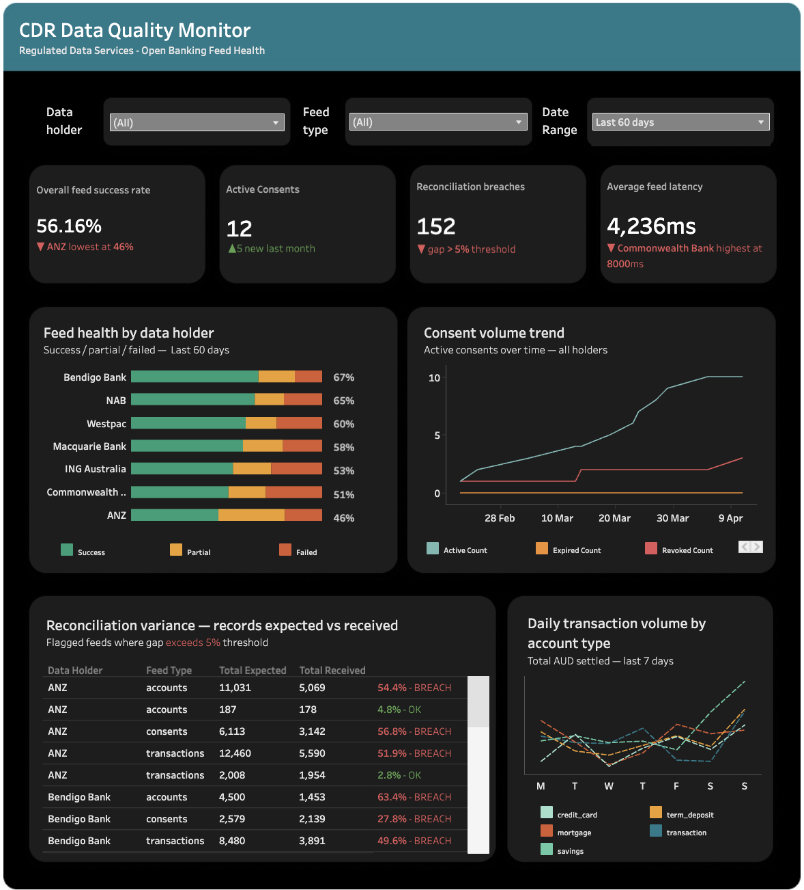

# CDR Data Quality Monitor


An end-to-end data quality monitoring pipeline simulating a real-world **Consumer Data Right (CDR)** open banking environment. Built to demonstrate data analytics capabilities relevant to regulated data services — including feed health monitoring, automated reconciliation, data validation, and product KPI dashboards.

> **Context:** Under Australia's Consumer Data Right legislation, accredited data holders (banks) must share consumer data with third-party fintechs via standardised API feeds. This project monitors the quality and reliability of those feeds across a simulated multi-holder CDR ecosystem.

---

## Dashboard



**[View on Tableau Public →](https://public.tableau.com/profile/api/publish/Book1_17766011956550/Dashboard2)**

---

## Architecture

```
data/raw/                      ← synthetic CDR data (5 CSV files)
    │
    ▼
src/load_to_db.py              ← loads CSVs into SQLite as raw_* tables
    │
    ▼
src/clean_layer.sql            ← validates, deduplicates, casts types → clean_* tables
    │
    ▼
src/agg_layer.sql              ← aggregates KPIs → agg_* tables → exported to data/agg/
    │
    ▼
src/quality_checks.py          ← automated validation rules → data/audit_log.csv
    │
    ▼
Tableau Dashboard              ← 4 charts + 4 KPI cards from data/agg/ CSVs
```

---

## Project Structure

```
cdr-data-quality-monitor/
├── data/
│   ├── raw/
│   │   ├── customers.csv
│   │   ├── accounts.csv
│   │   ├── consents.csv
│   │   ├── transactions.csv
│   │   └── feed_logs.csv
│   ├── agg/
│   │   ├── agg_consent_summary.csv
│   │   ├── agg_feed_health.csv
│   │   ├── agg_reconciliation.csv
│   │   └── agg_transaction_volumes.csv
│   └── audit_log.csv
├── img/
│   ├── dashboard.png
├── src/
│   ├── agg_layer.sql
│   ├── audit_layer.ipynb   
│   ├── cdr_monitor.db 
│   ├── clean_layer.sql
│   ├── generate_cdr_data.ipynb 
│   └── load_to_db.ipynb 
│   
└── README.md
```

---

## How to Run

**1. Install dependencies**
```bash
pip install pandas faker
```

**2. Generate synthetic CDR data**
```bash
jupyter nbconvert --to notebook --execute src/generate_cdr_data.ipynb
```

**3. Load raw data into SQLite**
```bash
jupyter nbconvert --to notebook --execute src/load_to_db.ipynb
```

**4. Run SQL transformation layers**
```bash
sqlite3 src/cdr_monitor.db < src/clean_layer.sql
sqlite3 src/cdr_monitor.db < src/agg_layer.sql
```

**5. Run data quality checks**
```bash
jupyter nbconvert --to notebook --execute src/quality_checks.ipynb
```

**6. Open dashboard**. 

Connect Tableau to `data/agg/` CSVs or open `src/cdr_monitor.db` directly via SQLite ODBC. Dashboard published on Tableau Public — see link above.

---

## Data Overview

| Table | Rows | Description |
|---|---|---|
| `customers` | 200 | CDR-consenting customers across 6 Australian states |
| `accounts` | 320 | Bank accounts across 7 data holders |
| `consents` | 280 | Data sharing consent records with scope and status |
| `transactions` | 5,000 | Account transactions over 90 days |
| `feed_logs` | 400 | Data holder feed delivery logs with status and latency |

**Data holders simulated:** Commonwealth Bank, Westpac, ANZ, NAB, Bendigo Bank, ING Australia, Macquarie Bank

**Intentional data quality issues seeded for validation:**
- ~5% of accounts have null balances or future open dates
- ~4% of consents have missing customer IDs
- ~3% of transactions contain duplicate transaction IDs

---

## Data Quality Checks

| Check | Table | Rule | Outcome |
|---|---|---|---|
| Null balance | `accounts` | `balance_aud` must not be null | Replaced with 0.00, flagged |
| Future open date | `accounts` | `open_date` must not exceed today | Excluded from clean layer |
| Missing customer ID | `consents` | `customer_id` must not be null | Excluded — compliance risk |
| Duplicate transactions | `transactions` | `transaction_id` must be unique | Deduplicated via `MIN(rowid)` |
| Orphaned transactions | `transactions` | `account_id` must exist in accounts | Excluded via `INNER JOIN` |
| Reconciliation breach | `feed_logs` | Records received within 5% of expected | Flagged as BREACH in `agg_reconciliation` |
| Feed freshness | `feed_logs` | Feed must have run within 24 hours | Flagged in `audit_log.csv` |
| Negative amounts | `transactions` | `amount_aud` must be > 0 | Excluded from clean layer |

---

## Key Findings

**1. ANZ has the lowest feed reliability at 45.7% success rate**
ANZ consistently underperforms all other data holders, with a disproportionately high partial-feed rate. This suggests data is being sent but incompletely — pointing to a schema or pagination issue at the source rather than a full outage.

**2. 152 reconciliation breaches detected across all holders**
Over 38% of all feed runs had a gap between records expected and records received exceeding the 5% threshold. The worst single incident was an ANZ accounts feed that delivered only 5,069 of 11,031 expected records — a 54.4% gap. In a production environment, this would directly impact billing accuracy and regulatory reporting.

**3. 31 transactions removed during cleaning — duplicate and orphaned IDs**
Duplicate transaction IDs, if left uncleaned, would cause double-counting in any financial aggregation or billing calculation. Detection and deduplication is a critical step before any downstream reporting.

**4. Commonwealth Bank has the highest average feed latency**
Despite being the largest data holder, Commonwealth Bank recorded the highest average latency at 8,000ms peak — above the threshold where downstream data freshness is impacted.

**5. Active consent growth is healthy but revocations are rising**
Active consents grew steadily from February to April. However, both expired and revoked consent counts are also climbing — a signal worth monitoring at the product level, as rising revocations may indicate friction in the customer data-sharing experience.

---

## Dashboard Sheets

| Sheet | Data source | Chart type |
|---|---|---|
| Feed health by data holder | `agg_feed_health` | Stacked bar — success / partial / failed |
| Consent volume trend | `agg_consent_summary` | Line chart — active / expired / revoked |
| Reconciliation variance | `agg_reconciliation` | Text table — BREACH / OK status |
| Transaction volume by account type | `agg_transaction_volumes` | Multi-line — 5 account types |
| KPI cards (×4) | `agg_feed_health`, `agg_consent_summary`, `agg_reconciliation`, `clean_feed_logs` | Calculated fields |

---

## Skills Demonstrated

- **SQL** — multi-layer medallion architecture (raw → clean → aggregated), window functions, deduplication, referential integrity checks
- **Python** — synthetic data generation, automated pipeline orchestration, audit log output
- **Data validation** — completeness, freshness, schema conformance, reconciliation rules
- **Tableau** — KPI dashboard design, stacked bar, line charts, cross-table filters, LOD calculations
- **GitHub** — version-controlled SQL, notebooks, and documentation
- **Domain knowledge** — Consumer Data Right (CDR), open banking feeds, data holder/recipient architecture

---

## About

Built as a portfolio project to demonstrate product data analytics capabilities in a regulated open banking context, aligned with the Consumer Data Right (CDR) framework administered by the ACCC and Data Standards Body in Australia.

---

*Synthetic data only — no real customer or financial data used.*